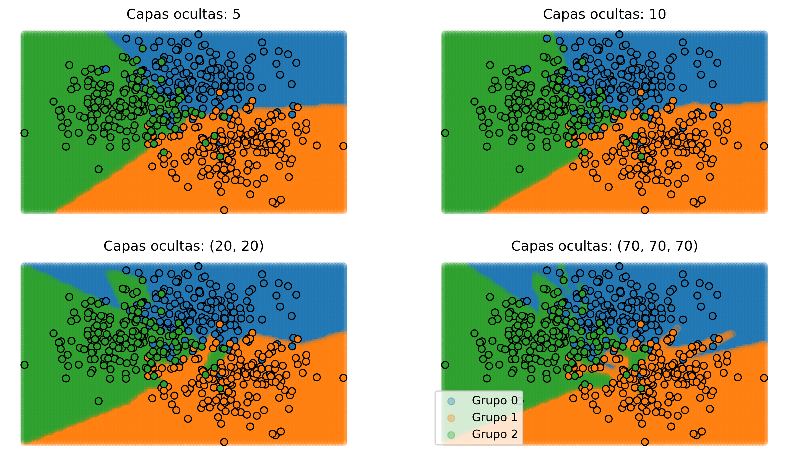
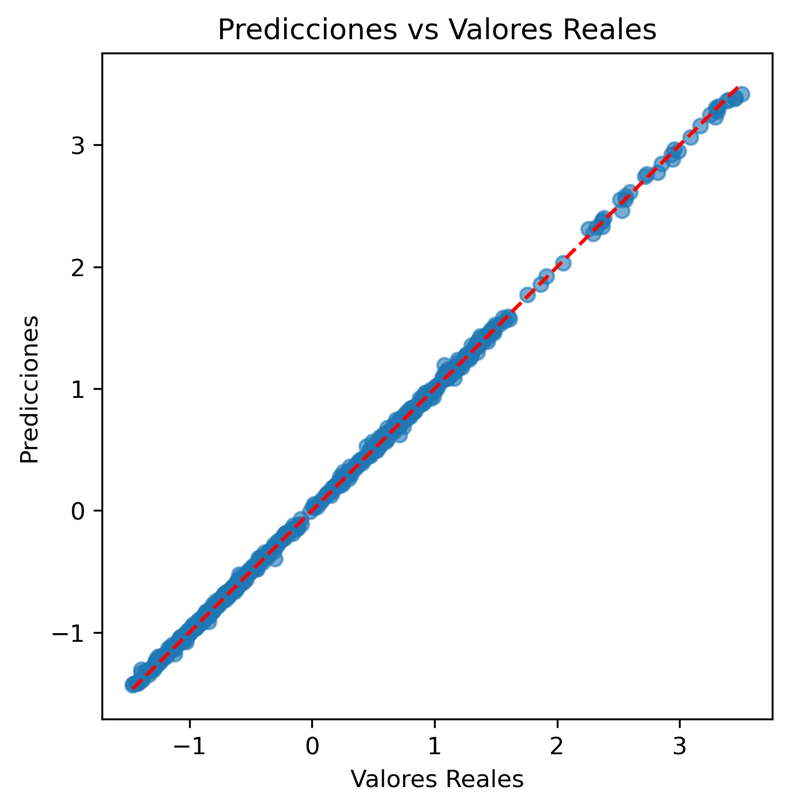

¡Claro! Aquí tienes el README traducido y adaptado al español para que sea profesional y fácil de entender:

---

# **Prototipado de Redes Neuronales para Clasificación y Regresión**

### **Descripción del Proyecto**
Este proyecto explora el desarrollo y evaluación de redes neuronales multicapa (*Multi-Layer Perceptron*, MLP) con arquitecturas variables. El objetivo es analizar cómo diferentes hiperparámetros y configuraciones afectan la capacidad de aprendizaje y el rendimiento de los modelos en tareas de clasificación y regresión.

---

### **Características Clave**
1. **Clasificación con Datos Simulados**:
   - Prototipos de modelos MLP con diferentes niveles de complejidad.
   - Visualización de las fronteras de clasificación para comprender el comportamiento de los modelos.
   - Comparación del rendimiento según la profundidad y tamaño de las capas ocultas.

2. **Optimización Bayesiana de Hiperparámetros**:
   - Uso de `Optuna` para optimizar hiperparámetros como la tasa de aprendizaje, alfa y el tamaño de las capas ocultas.
   - Mejora significativa del rendimiento mediante optimización dirigida.

3. **Búsqueda Aleatoria de Hiperparámetros**:
   - Aplicación de `RandomizedSearchCV` para la selección de hiperparámetros en tareas de clasificación y regresión.
   - Exploración eficiente del espacio de hiperparámetros para encontrar las mejores configuraciones.

4. **Regresión con Datos Financieros**:
   - Predicción de resultados financieros utilizando regresores MLP.
   - Evaluación de modelos de regresión con métricas como MAE, RMSE, R² y MAPE.
   - Análisis de la distribución de errores y comparación de predicciones con valores reales.

---

### **Tecnologías Utilizadas**
- **Python**: Lenguaje principal de programación.
- **Scikit-learn**: Modelado y evaluación de MLP.
- **Optuna**: Optimización bayesiana de hiperparámetros.
- **Matplotlib**: Visualización de resultados.
- **Pandas y NumPy**: Procesamiento y manipulación de datos.

---

### **Estructura de Carpetas**
```plaintext
proyecto/
│
├── src/                        # Código fuente para clasificación y regresión
├── data/                       # Datos financieros utilizados para regresión
├── imagenes/                   # Visualizaciones generadas durante los experimentos
│   ├── 0_datos.png             # Visualización del conjunto de datos simulado
│   ├── 1_clases_modelos.png    # Fronteras de clasificación de modelos MLP
│   ├── 2_clases_modelos_random_grid.png
│   ├── 3_clases_modelos_bayes_grid.png
│   ├── 4_regresion_distribución_errores.png
│   └── 5_regresion_prediccion_real.png
└── README.md                   # Documentación del proyecto
```

---

### **Cómo Empezar**
#### **1. Requisitos Previos**
Asegúrate de tener instalados los siguientes componentes:
- Python 3.8 o superior.
- Librerías necesarias: `scikit-learn`, `optuna`, `numpy`, `pandas`, `matplotlib`.

Instala las dependencias con:
```bash
pip install -r requirements.txt
```

#### **2. Ejecución del Proyecto**
1. **Tarea de Clasificación**: Ejecuta el script `classification.py` para entrenar y visualizar clasificadores MLP.
2. **Tarea de Regresión**: Corre el script `regression.py` para optimizar hiperparámetros y evaluar modelos de regresión.

---

### **Ejemplos de Visualización**
#### **Fronteras de Clasificación**:


#### **Predicciones vs Valores Reales**:


---

### **Métricas de Rendimiento**
- **Clasificación**: Precisión mediante validación cruzada.
- **Regresión**: MAE, RMSE, R², MAPE y análisis de distribución de errores.

---

### **Contacto**
Si tienes preguntas o sugerencias, no dudes en comunicarte a través de [GitHub Issues](https://github.com/your-repo).

---

¿Te gustaría ajustar alguna parte o añadir algo más específico? 😊
